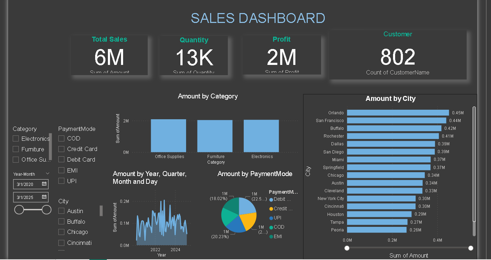

# Sales-Performance-Dashboard

  

## Overview
This project is an **interactive Power BI Sales Dashboard** designed to visualize and analyze sales performance.  
It provides a clear view of **Total Sales, Profit, Quantity Sold**, and **Customer Insights**, helping users understand business trends and make data-driven decisions.

## Features
- **Summary Cards**: Total Sales, Total Profit, Total Quantity, Total Customers  
- **Amount by Category**
- **Amount by Payment Mode**
- **Monthly Sales Trend**
- **Top Cities and Customers**
- **Interactive Slicers**:

## Dataset
The dashboard uses a dataset with the following fields:
- `sum of Amount`, `Profit`, `Quantity`  
- `Category & sub category`, `City`, `Customer Name`, `Payment Mode`  
- `Order Date`, `Year-Month`  
> You can replace this with your own `.csv` or `.xlsx` file if needed.

## How to Use
1. Open the `SALES DASHBOARD PROJECT.pbix' file in **Power BI Desktop**.  
2. Explore the dashboard visuals and interact with slicers to filter the data.  
3. Analyze trends, top-performing categories, cities, and customers.  

## Technologies Used
- **Power BI Desktop** for creating dashboards and visualizations.  
- Excel/CSV files for dataset input.  

## Author
**Oabile Moroka**  
Email: oabilemoroka@gmail.com  

---

